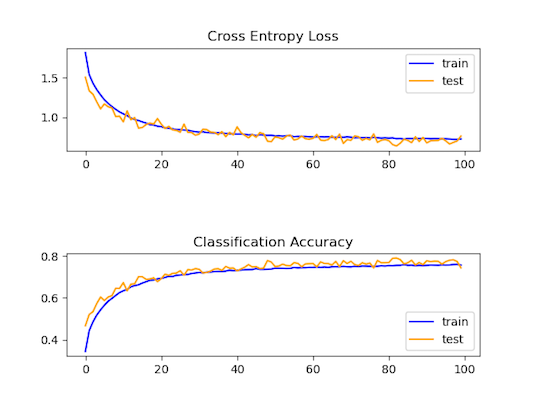
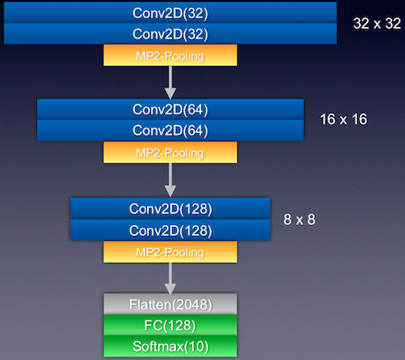
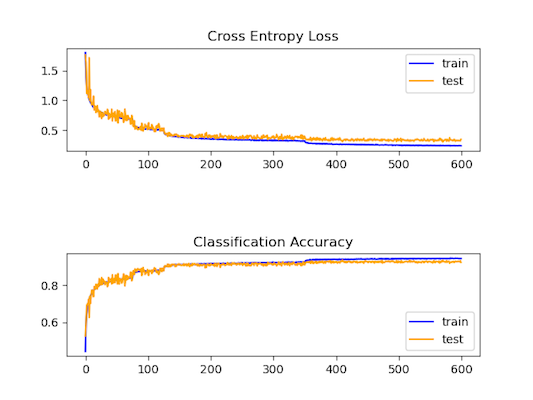

# vgg-like-cifar10
Do deep learning classification on the [CIFAR-10 database](https://www.cs.toronto.edu/~kriz/cifar.html) with VGG-like structure approach 93% validation accuracy.

### Keras Code Sample
It's referenced the structure of [Keras code sample of CIFAR-10](https://keras.io/examples/cifar10_cnn/). 
 
Validation Accuracy : ≈78% 

### Advanced Solution
Next, let's referenced [the tutorial from Jason Brownlee PhD](https://machinelearningmastery.com/how-to-develop-a-cnn-from-scratch-for-cifar-10-photo-classification/), who is a professional developer and machine learning practitioner. 
 
Validation Accuracy : ≈89% (Train / Test : 94.60% / 89.35%)

### Factional Max-Pooling
Ref. [https://arxiv.org/abs/1412.6071](https://arxiv.org/abs/1412.6071) 
Due to VGG-16 or ResNet-50 are so giant and deep neural network, I tried fractional max-pooling after read the research paper to make a deeper VGG-like neural network but smaller and  shallower than VGG-16 and ResNet-50.To reduce overfitting, we use global average pooling layer instead of full connection layer. 
 
Validation Accuracy : ≈93% (Train / Test : 97.94% / 93.55%)

### Simple Comparison
|            | VGG-16/VGG-19 |VGG-like + FMP|
|:----------:|:-------------:|:------------:|
|total params|10M+           |1.5M          |
| model size |200+ MB        |12.4M         |